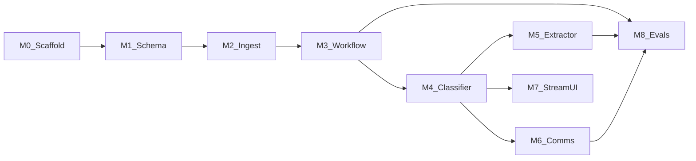

# Implementation plan: Chase

This plan maps [ARCHITECTURE.md](ARCHITECTURE.md) and [DESIGN_DOC.md](DESIGN_DOC.md) into **buildable milestones** for a greenfield repo (currently docs-first under `chase/`). Paths assume **Next.js 15 (App Router)** + **Drizzle** + **Neon** + **Mastra** on **Vercel**, with an async worker boundary.

---

## Milestone dependency graph

---

## M0 — Repository and app scaffold

**Goal:** Runnable Next.js app with env wiring, lint, and a single health route.

| Task | Notes |
|------|--------|
| Init Next.js 15 App Router, TypeScript, ESLint/Prettier | Align with README stack. |
| `.env.example` | `DATABASE_URL`, LLM keys, optional `BLOB_READ_WRITE_TOKEN`, queue provider keys. |
| `pnpm` / `npm` lockfile | Pick one package manager and document in README. |

**Acceptance criteria**

- `npm run dev` (or equivalent) serves a page.
- CI-ready script: `npm run lint` + `npm run build` succeed.

**Test gate**

- Smoke: hit `/api/health` or home page in CI.

---

## M1 — Database schema and migrations (Drizzle + Neon)

**Goal:** Relational core from [DESIGN_DOC.md](DESIGN_DOC.md) §2.1 with idempotent migrations.

| Artifact | Purpose |
|----------|---------|
| `src/db/schema/requirements.ts` | `period_end`, entity, status enum, timestamps. |
| `src/db/schema/replies.ts` | FK to requirement; blob keys / raw metadata. |
| `src/db/schema/agent_runs.ts` | FK to reply + requirement; status; started/finished. |
| `src/db/schema/audit_logs.ts` | Append-only; `step`, `prompt_version`, `model`, `reasoning`, `confidence`, `cost_usd`, `latency_ms`, `artifact_url`, FK `run_id`. |
| `drizzle/` migrations | Generated from schema. |

**Acceptance criteria**

- All tables exist in Neon; FKs enforce requirement ↔ reply ↔ run integrity.
- No updates to `audit_logs` rows in application code (insert-only API).

**Test gate**

- Integration test: insert requirement → reply → run → two audit rows; assert immutability contract in code review (optional DB trigger later).

---

## M2 — Ingestion API and async handoff

**Goal:** `POST /api/borrower-reply` persists payload and enqueues processing without blocking on Mastra.

| Artifact | Purpose |
|----------|---------|
| `src/app/api/borrower-reply/route.ts` | Validate body, write `replies`, set requirement to `RECEIVED`, enqueue job. |
| `src/jobs/process-reply.ts` (or Inngest function) | Entry point invoked by queue; creates `agent_runs` row. |

**Acceptance criteria**

- HTTP returns in **under 2 seconds** with `{ runId }` while work continues async.
- Duplicate submission idempotency (optional `client_request_id` header) documented or implemented.

**Test gate**

- API test: mock queue handler; assert DB rows after handler runs.

---

## M3 — Mastra workflow shell and router

**Goal:** Orchestration graph: Classifier → Router → one of Extract / Communicate / Escalate; each step writes `audit_logs` before next.

| Artifact | Purpose |
|----------|---------|
| `src/agents/workflow.ts` | Mastra workflow definition; explicit branches. |
| `src/agents/router.ts` | Pure function: classifier output → next step + requirement state updates. |

**Acceptance criteria**

- Failed mid-workflow run can be **retried** from last successful persisted step (design goal: resume).
- State transitions match [DESIGN_DOC.md](DESIGN_DOC.md) §2.2.

**Test gate**

- Unit tests for router truth table (VALID / INVALID / LOW_CONFIDENCE).

---

## M4 — Classifier + temporal validation

**Goal:** Implement [ARCHITECTURE.md](ARCHITECTURE.md) §3: requirement `period_end`, first-pages text, ±2 day buffer; tag every call with `prompt_version`.

| Artifact | Purpose |
|----------|---------|
| `src/agents/classifier.ts` | LLM + structured output (Zod); includes confidence. |
| `src/lib/temporal.ts` | Deterministic date extraction/normalization (**ob-06 fix** lands here). |

**Acceptance criteria**

- Golden cases **hp-01**, **wp-02**, **ob-06** (after fix) behave per [README.md](README.md) eval table.
- Classifier reasoning token cap enforced (DESIGN_DOC §5).

**Test gate**

- Golden-set tests in `evals/` or `src/evals/` calling classifier with fixtures (mocked LLM or recorded responses).

---

## M5 — Extractor with Zod and single retry

**Goal:** Strict JSON extraction; one retry on Zod failure with error message in context.

| Artifact | Purpose |
|----------|---------|
| `src/agents/extractor.ts` | Schema + retry policy. |
| `src/schemas/financials.ts` | Zod definitions shared with API if needed. |

**Acceptance criteria**

- **pd-04** partial ingest policy encoded (either partial schema or explicit “partial” flag + state).
- Invalid JSON from model triggers **exactly one** retry path.

**Test gate**

- Unit: feed malformed JSON → retry invoked; second success persists.

---

## M6 — Communicator and escalator

**Goal:** Borrower-facing copy and human handoff summaries; both write `audit_logs` with `step` = `communication` / `escalation`.

| Artifact | Purpose |
|----------|---------|
| `src/agents/communicator.ts` | Follow-up templates grounded in mismatch reason. |
| `src/agents/escalator.ts` | Short internal summary + recommended RM action. |

**Acceptance criteria**

- **pe-03**, **un-05**, **ur-07** paths hit escalate or follow-up per eval expectations.
- Mocked `sendEmail()` unchanged in prototype; logs show “would send.”

**Test gate**

- Snapshot or schema tests on generated message structure (no PII leakage in logs beyond test fixtures).

---

## M7 — Live audit UI (SSE)

**Goal:** Dashboard reads `audit_logs` for a `run_id`; SSE pushes new rows.

| Artifact | Purpose |
|----------|---------|
| `src/app/api/runs/[id]/events/route.ts` | SSE endpoint polling DB or LISTEN/NOTIFY if adopted. |
| `src/app/dashboard/...` | Lending UI; link to `artifact_url`. |

**Acceptance criteria**

- New audit rows appear in UI without full page reload.
- Read path can target a **read replica** URL when configured (DESIGN_DOC §4).

**Test gate**

- E2E optional: Playwright subscribes to SSE and sees N events after mocked run.

---

## M8 — Eval harness and regression CI

**Goal:** Automate the 8-case golden set; fail CI on regression; keep [evals/LOGS.md](evals/LOGS.md) updated for intentional failures.

| Artifact | Purpose |
|----------|---------|
| `evals/cases/*.json` | Fixture metadata: requirement, attachment refs, expected action. |
| `evals/run.ts` | Orchestrates cases; writes summary artifact. |
| GitHub Action (or other CI) | Run `evals` on PR. |

**Acceptance criteria**

- README accuracy line is reproducible from `evals/run.ts` output.
- ob-06 documented until utility fix flips it to Pass.

**Test gate**

- CI job: `npm run eval` exits non-zero on mismatch.

---

## Cross-cutting checklist

| Topic | Action |
|-------|--------|
| **Naming** | Use `audit_logs` table + `AuditEntry`-shaped rows consistently ([ARCHITECTURE.md](ARCHITECTURE.md)). |
| **Cost / latency** | Persist on every LLM audit row for unit economics. |
| **Security** | No cross-tenant queries; scope every query by org/borrower ID when multi-tenant. |
| **Docs** | Keep README eval table in sync with `evals/` results. |

---

## Suggested order of execution

1. M0 → M1 → M2 (foundation + data + ingest).
2. M3 (workflow skeleton with **mocked** agents returning fixed outputs).
3. M4 → M5 → M6 (real agents behind feature flags).
4. M7 (visibility).
5. M8 (quality bar).

This sequence minimizes rework: **schema and audit contract** stay stable while agent prompts iterate.
